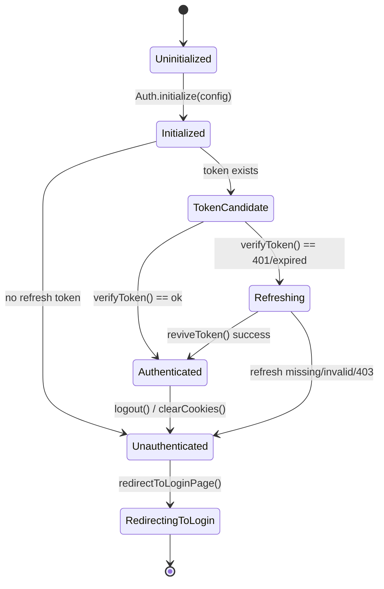
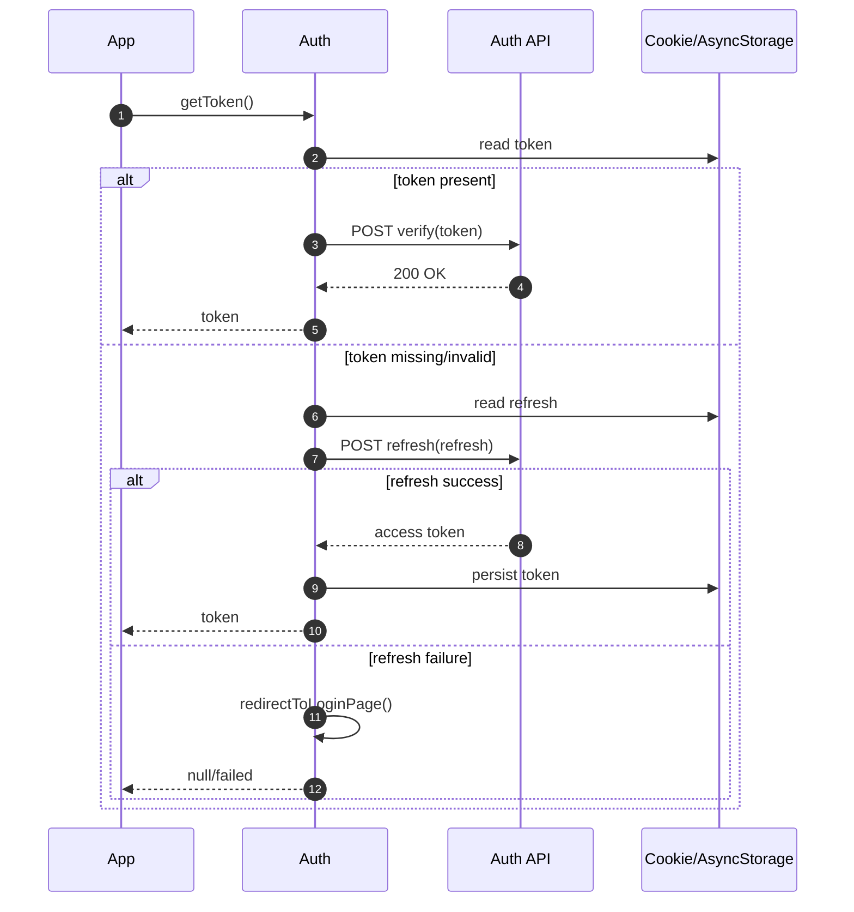
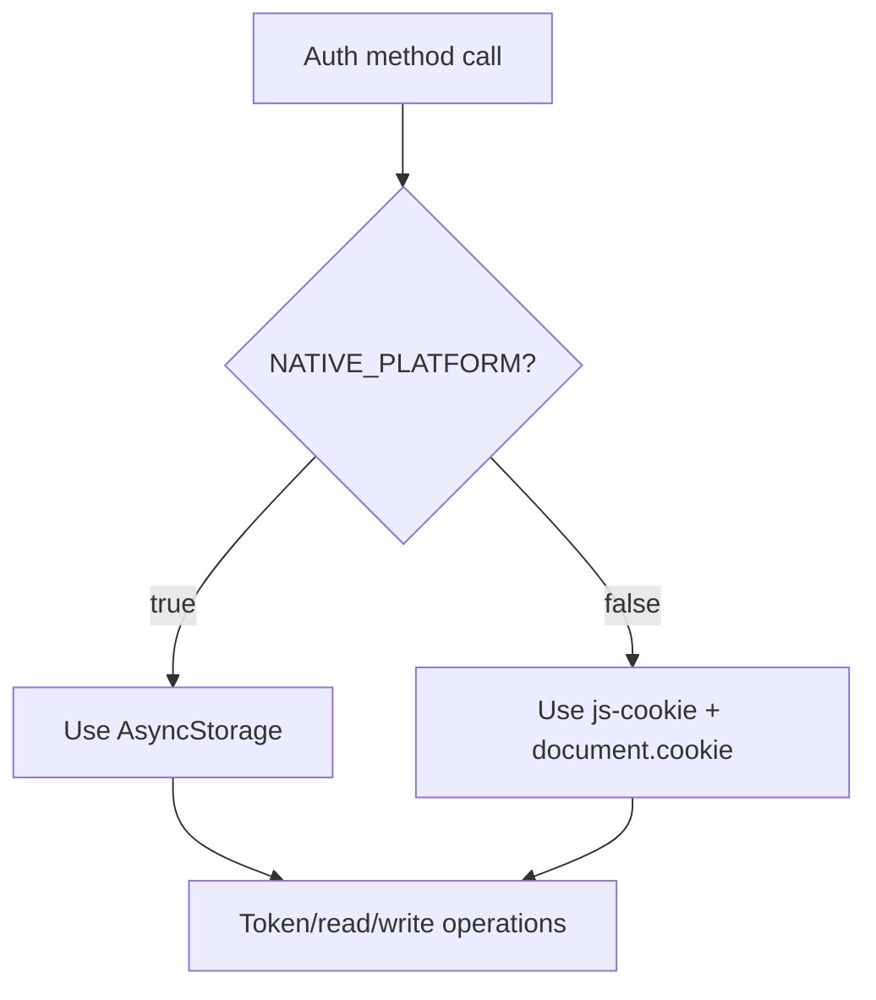

# envoy-ts-auth

`envoy-ts-auth` is a TypeScript authentication helper for browser and React Native clients.
It is maintained in the open by NETIX.AI OSS and designed for teams that need a small, predictable auth utility around token lifecycle, redirect orchestration, and user-context helpers.

## Why This Library

- One initialization path: `Auth.initialize(config)`
- Shared auth behavior for web and native runtimes
- Built-in token verify/refresh flow with explicit fallback behavior
- Simple public API surface for app-level auth guards and bootstrapping

## Install

```bash
yarn add github:NETIX-AI-OSS/envoy-ts-auth
# or
npm i github:NETIX-AI-OSS/envoy-ts-auth
```

The package is currently distributed as GitHub source (no npm release yet).

## Quick Start

```ts
import { Auth, type AuthConfig } from "envoy-ts-auth";

const config: AuthConfig = {
  COOKIE_TOKEN_TTL: "300",
  COOKIE_REFRESH_TTL: "86400",
  COOKIE_SECURE: true,
  COOKIE_DOMAIN: ".example.com",
  BASE_DOMAIN: "example.com",
  CURRENT_APP_DOMAIN: "app.example.com",
  LOGIN_PAGE_URL: "https://auth.example.com/login",
  AUTH_BASE_URL: "https://auth.example.com",
  LAUNCHPAD_PAGE_URL: "https://app.example.com",
  REFRESH_ENDPOINT: "/auth/token/refresh/",
  VERIFY_ENDPOINT: "/auth/token/verify/",
  TOKEN_ENDPOINT: "/auth/token/",
  NATIVE_PLATFORM: false,
};

Auth.initialize(config);
const auth = Auth.getInstance();

await auth.verifyToken();
const user = await auth.getUser();
```

## Authentication State Model



## Token Workflow



## Storage Strategy



## Documentation

- Developer docs index: [`docs/README.md`](docs/README.md)
- Getting started: [`docs/getting-started.md`](docs/getting-started.md)
- Configuration reference: [`docs/configuration.md`](docs/configuration.md)
- Workflows: [`docs/workflows.md`](docs/workflows.md)
- Architecture notes: [`docs/architecture.md`](docs/architecture.md)
- Troubleshooting: [`docs/troubleshooting.md`](docs/troubleshooting.md)
- API reference (compact): [`docs/api/README.md`](docs/api/README.md)
- OSS release checklist: [`docs/release-checklist.md`](docs/release-checklist.md)

## Development

```bash
yarn install
yarn build
yarn docs
```

## Governance

- Contributing guide: [`CONTRIBUTING.md`](CONTRIBUTING.md)
- Code of conduct: [`CODE_OF_CONDUCT.md`](CODE_OF_CONDUCT.md)
- Security policy: [`SECURITY.md`](SECURITY.md)
- Changelog: [`CHANGELOG.md`](CHANGELOG.md)

## License

Licensed under GNU Affero General Public License v3.0 only.
See [`LICENSE`](LICENSE).
