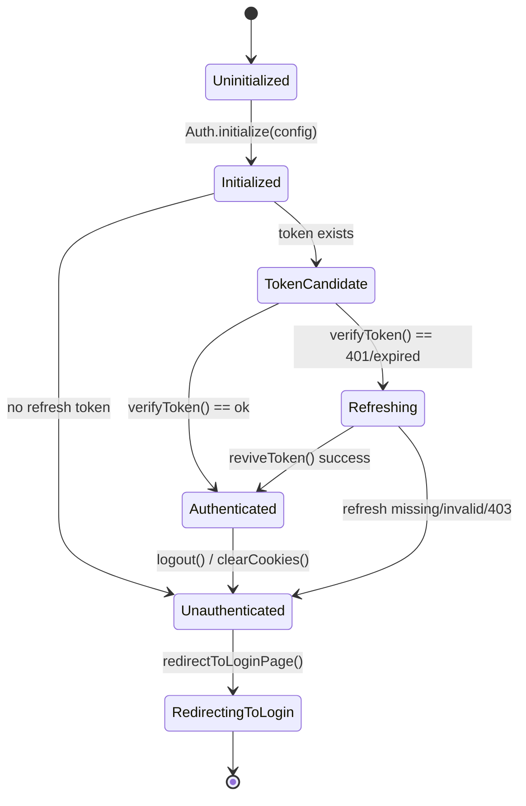
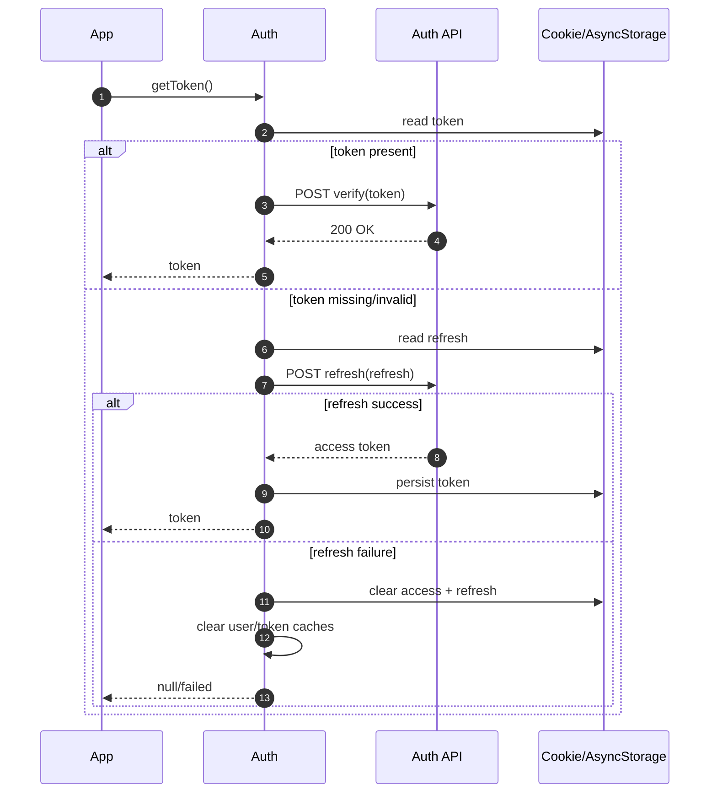
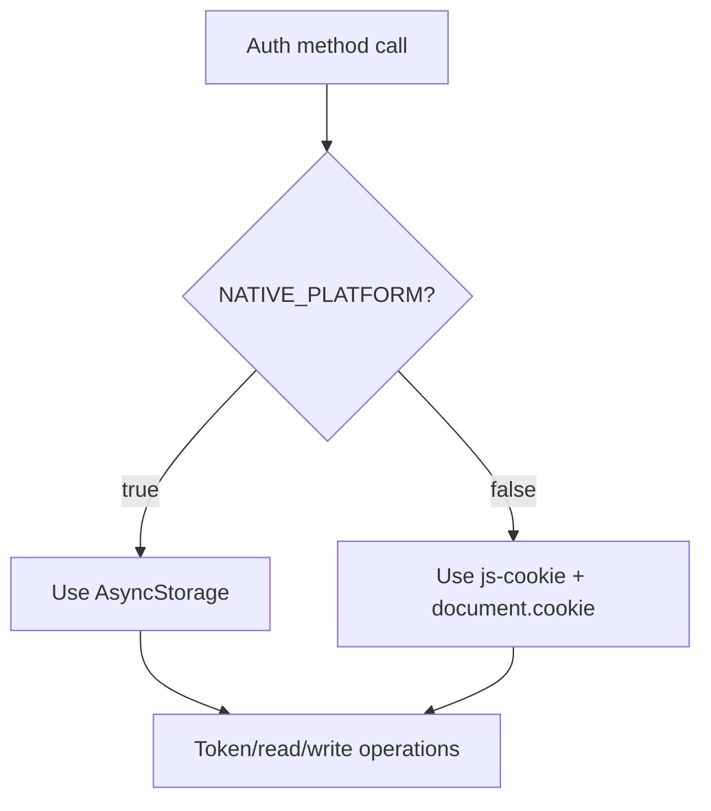

# envoy-ts-auth

`envoy-ts-auth` is a TypeScript authentication helper for BFF-backed browser applications and React Native clients.
It is maintained in the open by NETIX.AI OSS and designed for teams that need a small, predictable auth utility around token lifecycle, redirect orchestration, and user-context helpers.

## Why This Library

- One initialization path: `Auth.initialize(config)`
- Shared auth behavior for web and native runtimes
- Built-in token verify/refresh flow with explicit fallback behavior
- Simple public API surface for app-level auth guards and bootstrapping
- Framework-neutral organization locale fetching and identity-safe offline cache

## Install

```bash
yarn add github:NETIX-AI-OSS/envoy-ts-auth
# or
npm i github:NETIX-AI-OSS/envoy-ts-auth
```

The package is currently distributed as GitHub source (no npm release yet).

## Browser quick start (BFF)

```ts
import { BffAuth } from "envoy-ts-auth";

const auth = new BffAuth({
  baseUrl: "/bff/auth",
  getCsrfToken: () => document.querySelector('meta[name="csrf-token"]')!.getAttribute("content")!,
});

const session = await auth.bootstrap();
if (!session.authenticated) auth.startAuthorizationCodeLogin();
```

The BFF must set host-only `HttpOnly; Secure; SameSite=Lax` session cookies,
rotate refresh state server-side, validate CSRF on unsafe methods, and proxy API
calls. `BffAuth` never exposes an access or refresh token to JavaScript and
rejects cross-origin BFF URLs.

`Auth` remains available for React Native and existing browsers. Browser
`Auth` defaults to the legacy shared-cookie mode during migration, so a library
upgrade alone cannot interrupt one-point login. After an application and its
BFF are ready, set `BROWSER_SESSION_MODE: "bff-only"` to disable the legacy
browser token APIs for that application. Do not select that mode before the
coordinated cutover.

See the [BFF migration contract](docs/bff-migration.md) for the OAuth
authorization-code + PKCE endpoints, safe rollout order, and rollback.

Organization terminology is available through the separately configured
`LocaleRuntime`; see the [locale runtime guide](docs/localization.md). It
supports browser localStorage and React Native AsyncStorage without requiring
an i18n library.

When verification or refresh cannot establish a valid session, the library
returns no access token and removes both persistent and in-memory session
state. Configure `LOGOUT_ENDPOINT` after the auth backend supports revoking
the presented access token and optional `{ refresh }` token; local logout is
always completed even if the revocation request is unavailable.

## Authentication State Model



## Token Workflow



## Storage Strategy



## Documentation

- Developer docs index: [`docs/README.md`](docs/README.md)
- Getting started: [`docs/getting-started.md`](docs/getting-started.md)
- Configuration reference: [`docs/configuration.md`](docs/configuration.md)
- Workflows: [`docs/workflows.md`](docs/workflows.md)
- Organization locale runtime: [`docs/localization.md`](docs/localization.md)
- BFF and one-point-login migration: [`docs/bff-migration.md`](docs/bff-migration.md)
- Architecture notes: [`docs/architecture.md`](docs/architecture.md)
- Troubleshooting: [`docs/troubleshooting.md`](docs/troubleshooting.md)
- API reference (compact): [`docs/api/README.md`](docs/api/README.md)
- OSS release checklist: [`docs/release-checklist.md`](docs/release-checklist.md)

## Development

```bash
yarn install
yarn build
yarn docs
```

## Governance

- Contributing guide: [`CONTRIBUTING.md`](CONTRIBUTING.md)
- Code of conduct: [`CODE_OF_CONDUCT.md`](CODE_OF_CONDUCT.md)
- Security policy: [`SECURITY.md`](SECURITY.md)
- Changelog: [`CHANGELOG.md`](CHANGELOG.md)

## License

Licensed under GNU Affero General Public License v3.0 only.
See [`LICENSE`](LICENSE).
