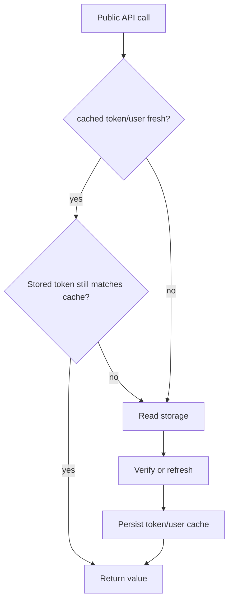

# Architecture Notes

## Design Goals

- Keep a small client-side auth abstraction with predictable side effects.
- Support browser and React Native via one runtime switch.
- Encapsulate token verification/refresh logic behind simple methods.

## Core Components

- `Auth` singleton: lifecycle entrypoint and behavior orchestrator.
- Storage adapter behavior:
  - Browser: `js-cookie` and `document.cookie`
  - Native: `@react-native-async-storage/async-storage`
- Network calls: direct `fetch` to token, verify, and refresh endpoints (configurable via `TOKEN_ENDPOINT`, `VERIFY_ENDPOINT`, `REFRESH_ENDPOINT`), and user endpoint (hard-coded to `AUTH_BASE_URL + /auth/me/`).

## Request/Cache Model

## Redirect Model

- `redirectToLoginPage()`:
  - Uses `ON_LOGOUT` callback when provided.
  - Else redirects to `LOGIN_PAGE_URL`, adding `continue` only when the current URL is on the configured app host and passes redirect validation.
- `redirectToSourcePage()`:
  - Uses `ON_LOGIN` callback when provided.
  - Else redirects to a validated `continue` URL or `LAUNCHPAD_PAGE_URL`.

## Boundaries

- Library scope: token lifecycle, user/group/permission fetch helpers, redirect orchestration.
- Out of scope: backend auth policy, token issuance rules, route-level authorization frameworks.

## Failure Model

- A token is returned only after successful verification or refresh.
- Verification/refresh failure clears access, refresh, token cache, and user cache.
- A business API `401` clears session state; a `403` remains an authorization
  result and does not force logout.
- Server-side logout is optional and best effort. Backend services and Envoy
  must continue to enforce token validity and permissions independently.
