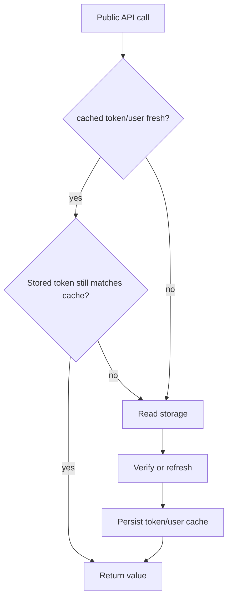

# Architecture Notes

## Design Goals

- Keep a small client-side auth abstraction with predictable side effects.
- Keep browser credentials behind a same-origin BFF and support native tokens through platform storage.
- Encapsulate token verification/refresh logic behind simple methods.

## Core Components

- `BffAuth`: browser entrypoint using server-managed HttpOnly sessions.
- `Auth` singleton: native token lifecycle entrypoint; legacy browser storage requires an explicit insecure escape hatch.
- Storage adapter behavior:
  - Browser: no token storage; same-origin BFF cookies are inaccessible to JavaScript.
  - Native: `@react-native-async-storage/async-storage`
- Network calls: direct `fetch` to token, verify, and refresh endpoints (configurable via `TOKEN_ENDPOINT`, `VERIFY_ENDPOINT`, `REFRESH_ENDPOINT`), and user endpoint (hard-coded to `AUTH_BASE_URL + /auth/me/`).
- `LocaleRuntime`: an optional, framework-neutral organization locale client
  with injected token, fetch, and async storage providers. Its cache is scoped
  by API origin, application, user, organization, and language.

## Request/Cache Model

## Redirect Model

- `redirectToLoginPage()`:
  - Uses `ON_LOGOUT` callback when provided.
  - Else redirects to `LOGIN_PAGE_URL`, adding `continue` only when the current URL is on the configured app host and passes redirect validation.
  - No-ops once a redirect is under way, so concurrent callers produce one navigation, and no-ops when `LOGIN_PAGE_URL` is the page already showing (same origin and path), so a login app pointed at itself cannot loop.
  - That de-duplication covers involuntary redirects only. `login()` and `logout()` re-arm it, so a deliberate `logout()` always redirects; `redirectToSourcePage()` and `isLoggedIn()` never consult it.
- `redirectToSourcePage()`:
  - Uses `ON_LOGIN` callback when provided.
  - Else redirects to a validated `continue` URL or `LAUNCHPAD_PAGE_URL`.

## Boundaries

- Library scope: token lifecycle, user/group/permission fetch helpers, redirect orchestration.
- Locale scope: health-gated effective-locale retrieval, conditional requests,
  bounded persistence, offline preference replay, and session isolation hooks.
- Out of scope: backend auth policy, token issuance rules, route-level authorization frameworks.
- Out of scope: i18n rendering, React lifecycle integration, AppState/network
  subscriptions, and tenant-discovery authorization.

## Failure Model

- A token is returned only after successful verification or refresh.
- Verification/refresh failures are classified before anything is discarded:
  - Terminal (no refresh token, an empty refresh token, or a 401/403/404 from the
    auth service) clears access, refresh, token cache, and user cache, then
    redirects to login.
  - Transient (429/5xx or a network error) keeps every credential and returns the
    status, because a refresh token valid for hours has not been judged yet.
- A business API `401` clears session state; a `403` remains an authorization
  result and does not force logout.
- Server-side logout is optional and best effort. Backend services and Envoy
  must continue to enforce token validity and permissions independently.
