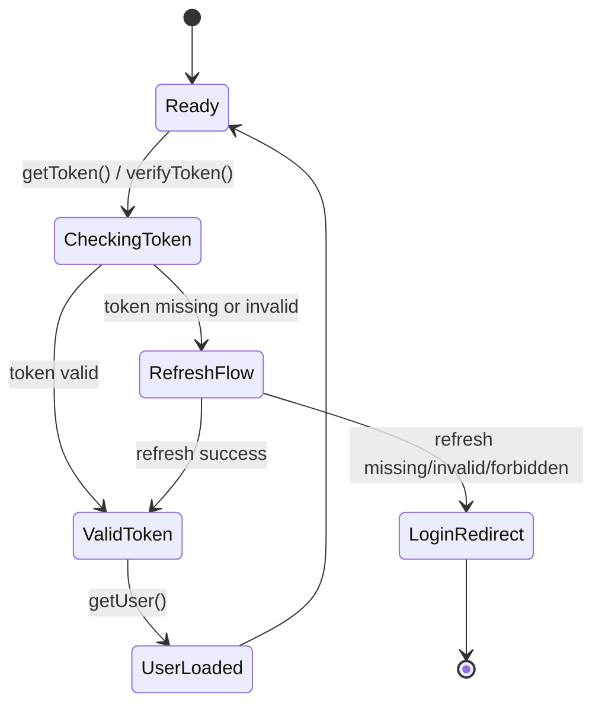
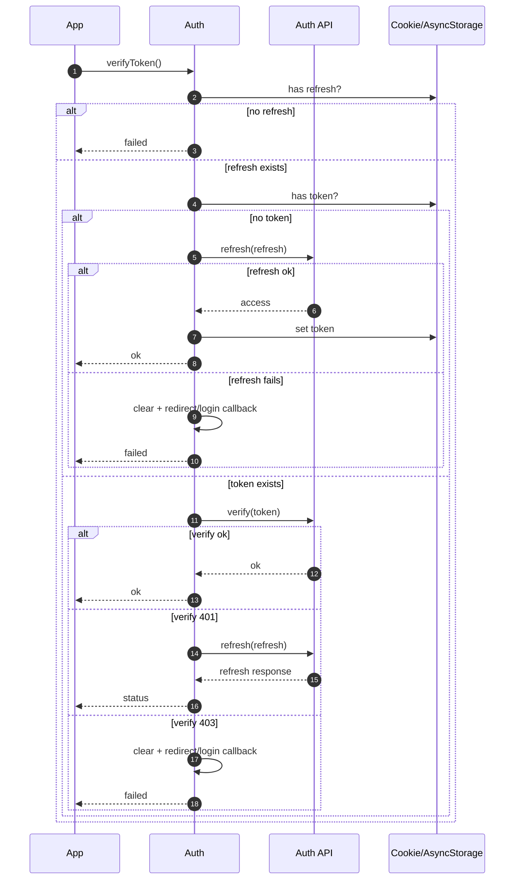
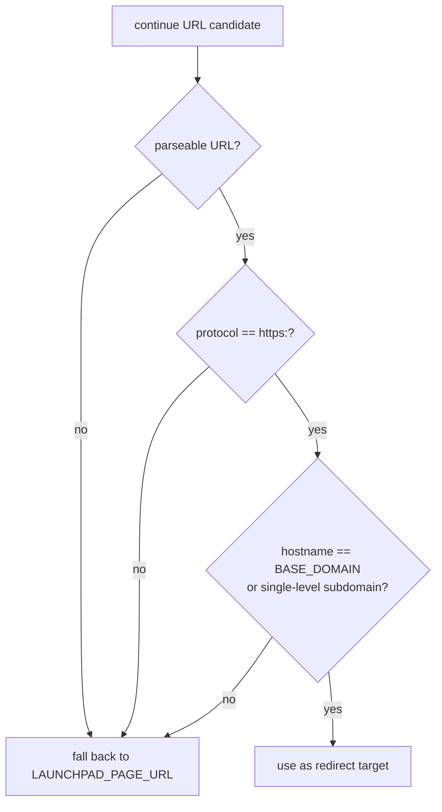

# Auth Workflows

This page captures runtime behavior of `auth` during token checks, refresh attempts, and login/logout transitions.

## Runtime State Diagram



## Verify + Refresh Sequence



## Login Sequence

```mermaid
flowchart LR
  A[login(username, password)] --> B[POST TOKEN_ENDPOINT]
  B --> C{200 + access + refresh?}
  C -- yes --> D[Store token]
  D --> E[Store refresh]
  E --> F[redirectToSourcePage or ON_LOGIN]
  C -- no --> G[return false/undefined]
```

## Logout Sequence

```mermaid
flowchart LR
  A[logout()] --> B[clearCookies or AsyncStorage remove]
  B --> C[redirectToLoginPage or ON_LOGOUT]
```

## Redirect Validation

All redirect targets derived from the `continue` query parameter are validated before use:



`redirectToLoginPage` additionally only appends `continue` when the current page's hostname matches `CURRENT_APP_DOMAIN`.
